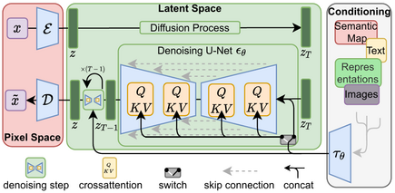

# BiomolGeneration

The generation of biomolecules using Generative Adversarial Networks (GANs) and diffusion models is an advanced technique in computational biology and chemistry. These methods aim to create new biomolecules, such as proteins, small molecules, or drug candidates, that exhibit desired properties or functions. Let’s dive into how GANs, diffusion models, RL, VAE and GNNs are used for this purpose. The use of **Variational Autoencoders (VAEs)** and **Junction Tree Variational Autoencoders (JT-VAEs)** in biomolecule generation provides another robust approach alongside GANs and diffusion models. These models are particularly well-suited for generating small molecules, optimizing molecular properties, and learning molecular representations. 
 - [GANs](##-1.-generative-adversarial-networks-(gans)-for-biomolecule-generation)
 - [Diffusion](##-2.-diffusion-models-for-biomolecule-generation)
 - [VAE](##-3.-variational autoencoders-(vaes)-for-biomolecule-generation)
 - ## 1. Generative Adversarial Networks (GANs) for Biomolecule Generation
 - ## 1. Generative Adversarial Networks (GANs) for Biomolecule Generation
 - ## 1. Generative Adversarial Networks (GANs) for Biomolecule Generation

## 1. Generative Adversarial Networks (GANs) for Biomolecule Generation

#### What are GANs?
GANs consist of two neural networks: a generator and a discriminator. These networks are trained together in a competitive framework:
- **Generator**: Creates fake data (synthetic biomolecules) from random noise.
- **Discriminator**: Tries to distinguish between real data (existing biomolecules) and the fake data generated by the generator.
- The goal is for the generator to produce data that the discriminator can no longer distinguish from real data, thereby generating realistic synthetic biomolecules.

#### How GANs Are Applied to Biomolecule Generation
- **Molecular Structure Generation**: GANs can be used to generate new molecular structures, such as small organic molecules, peptides, or even protein fragments. The generator learns from a dataset of known molecular structures and creates new candidates.
- **Molecular Optimization**: GANs can also be applied to optimize molecular properties, such as binding affinity, solubility, or stability. The generator creates molecules with improved characteristics based on the feedback received from the discriminator.
- **Conditional GANs (cGANs)**: These GANs incorporate additional information (e.g., desired molecular properties) into the generation process, allowing for more controlled and property-specific molecule generation.

#### Challenges with GANs in Biomolecule Generation
- **Mode Collapse**: The generator might produce only a limited set of similar molecules, lacking diversity.
- **Training Stability**: GANs can be difficult to train, as the balance between the generator and discriminator is crucial.
- **Quality of Generated Molecules**: The generated molecules might not always be chemically valid or biologically relevant.

#### Ressources:

## 2. Diffusion Models for Biomolecule Generation

#### What Are Diffusion Models?
Diffusion models are a class of generative models that learn to generate data by reversing a diffusion process. They progressively transform random noise into a structured output, such as a molecule, through a series of refinement steps:
- **Forward Process (Diffusion)**: Data is gradually corrupted by adding noise in small steps, leading from a clean molecule representation to random noise.
- **Reverse Process (Denoising)**: A neural network learns to reverse the diffusion process step-by-step, transforming random noise back into a valid molecular structure.

#### How Diffusion Models Are Applied to Biomolecule Generation
- **Molecular Structure Generation**: By learning the reverse diffusion process, these models can generate molecular structures from noise. This approach can produce diverse and high-quality molecular structures.
- **Protein Folding and Structure Prediction**: Diffusion models can be used to predict protein structures by generating 3D atomic coordinates from noise, guided by known protein folding rules or structural constraints.
- **Conditional Generation with Desired Properties**: Like cGANs, diffusion models can incorporate property constraints into the generation process to produce molecules with specific characteristics.

#### Advantages of Diffusion Models in Biomolecule Generation
- **High Diversity**: Diffusion models tend to produce a diverse set of molecules compared to GANs.
- **Stable Training**: These models are generally more stable to train than GANs, as they don’t require a discriminator.
- **High Quality of Generated Structures**: The progressive refinement process of diffusion models can produce very accurate and realistic molecular structures.

#### Ressources : 

The use of **Variational Autoencoders (VAEs)** and **Junction Tree Variational Autoencoders (JT-VAEs)** in biomolecule generation provides another robust approach alongside GANs and diffusion models. These models are particularly well-suited for generating small molecules, optimizing molecular properties, and learning molecular representations. 

## 3. **Variational Autoencoders (VAEs) for Biomolecule Generation**
#### What are VAEs?
VAEs are a type of generative model that learns the probability distribution of input data, such as molecular structures. They consist of an **encoder** and a **decoder**:
- **Encoder**: Maps the input (e.g., a molecular representation) to a lower-dimensional latent space.
- **Decoder**: Reconstructs the original data from this latent space representation, allowing for the generation of new data points.

#### How VAEs Are Applied to Biomolecule Generation
- **Molecular Structure Generation**: VAEs can generate new molecules by sampling from the latent space and decoding these samples to create novel molecular structures. The latent space captures the essential features of known molecules.
- **Molecular Optimization**: By navigating the latent space, VAEs can generate molecules with improved properties (e.g., higher binding affinity or solubility). The model can explore nearby regions in the latent space for optimization.
- **Property-Conditioned Generation**: VAEs can be extended to incorporate desired molecular properties directly into the latent space representation, guiding the generation toward molecules with specific characteristics.

#### Challenges with VAEs in Biomolecule Generation
- **Latent Space Quality**: The quality of the latent space representation significantly affects the quality and diversity of generated molecules.
- **Reconstruction Accuracy**: Ensuring that the decoder accurately reconstructs chemically valid molecules from the latent space is critical.

## 4. **Junction Tree Variational Autoencoders (JT-VAEs) for Biomolecule Generation**
#### What are JT-VAEs?
JT-VAEs extend traditional VAEs by explicitly considering the molecular structure as a **graph of substructures**, such as rings and functional groups. The model constructs a **junction tree** representation where each node represents a substructure.

#### How JT-VAEs Are Applied to Biomolecule Generation
- **Structured Molecular Generation**: By using a junction tree representation, JT-VAEs can generate molecular structures that respect the rules of chemical bonding and structural integrity. The model first generates the tree structure, then assembles the molecular graph.
- **Improved Property Optimization**: JT-VAEs can generate molecules that are more likely to be chemically valid because the tree representation allows for better control over structural features. This improves optimization for properties like drug-likeness.
- **Conditional Generation with Structural Constraints**: The model can incorporate specific substructures or functional groups as constraints, generating molecules that include these features while maintaining chemical validity.

#### Advantages of JT-VAEs in Biomolecule Generation
- **Higher Quality of Generated Molecules**: By using the junction tree representation, JT-VAEs ensure that generated molecules adhere to chemical rules.
- **Better Optimization Capabilities**: The explicit representation of molecular substructures improves the ability to optimize specific molecular properties.
- **Chemical Validity**: Compared to traditional VAEs, JT-VAEs produce molecules that are more likely to be chemically valid due to the structured generation process.

### **Applications of Biomolecule Generation by VAEs and JT-VAEs**
- **Drug Discovery**: Generating novel drug candidates and optimizing known compounds for enhanced therapeutic properties.
- **Protein Design**: Designing small peptide molecules or inhibitors that bind to specific protein targets.
- **Material Science**: Creating molecules for new materials with specific chemical or physical properties.

### **Challenges and Future Directions**
- **Latent Space Interpretability**: Making the latent space representation interpretable for molecular properties remains challenging.
- **Integration with Experimental Data**: Incorporating feedback from experimental assays can further refine the generation process.
- **Scalability to Large Molecules**: Extending VAEs and JT-VAEs to handle larger molecules, such as full proteins, requires additional techniques.
Using **Transformers** and **Graph Neural Networks (GNNs)** for biomolecule generation offers state-of-the-art techniques for learning molecular representations and creating novel molecular structures. These models excel at handling sequential and graph-based data, respectively, making them suitable for molecular structure prediction, optimization, and generation. Here's a detailed look at how each technique can be applied to biomolecule generation:

## 5. **Transformers for Biomolecule Generation**
#### What are Transformers?
Transformers are deep learning models initially designed for natural language processing tasks. They use a self-attention mechanism to understand relationships within sequential data. In biomolecule generation, transformers can be applied to linear molecular representations, such as SMILES strings (Simplified Molecular Input Line Entry System), which encode molecular structures as sequences.

#### How Transformers Are Applied to Biomolecule Generation
- **SMILES-based Generation**: Transformers can generate new molecules by treating molecular SMILES strings as text sequences. The model learns the rules of chemical syntax and generates new molecules by predicting the next token (character) in a sequence.
- **Property Prediction and Optimization**: Transformers can be trained to predict molecular properties from SMILES sequences and generate molecules that optimize specific properties (e.g., binding affinity, solubility). This is done by conditioning the generation on desired property values.
- **Sequence-to-Sequence Modeling for Molecular Transformations**: Transformers can also learn molecular transformations, such as predicting reaction outcomes or converting one molecular representation into another (e.g., predicting a product from reactants).

#### Challenges with Transformers in Biomolecule Generation
- **Data Quality and Quantity**: Large datasets are often needed to train transformers effectively for molecule generation.
- **Chemical Validity**: Ensuring that generated SMILES strings correspond to valid molecular structures can be challenging.
- **Sequence Length Limitations**: Very large molecules may present difficulties due to the sequential nature of SMILES strings.

## 6. **Graph Neural Networks (GNNs) for Biomolecule Generation**
#### What are GNNs?
GNNs are deep learning models that operate on graph-structured data. In the context of biomolecules, atoms are treated as nodes, and chemical bonds as edges, making the molecular structure a graph. GNNs learn to embed molecular graphs in a way that captures their structural and chemical properties.

#### How GNNs Are Applied to Biomolecule Generation
- **Graph-based Molecular Generation**: GNNs can directly generate molecular graphs by adding nodes (atoms) and edges (bonds) sequentially. This approach respects the molecular graph structure, resulting in chemically valid molecules.
- **Molecular Property Prediction**: GNNs can predict molecular properties, which can then be used to guide the generation process. For instance, generated molecules can be ranked and optimized based on predicted properties like binding affinity.
- **Integration with Other Techniques**: GNNs can be combined with generative models, such as VAEs or RL, to generate molecules with desired properties by optimizing over the learned molecular graph representations.

#### Advantages of GNNs in Biomolecule Generation
- **Directly Operates on Molecular Graphs**: This allows for more accurate modeling of molecular structures compared to SMILES-based approaches.
- **Scalability to Larger Molecules**: GNNs can handle larger molecular structures more efficiently than sequence-based models.
- **Chemical Validity**: Generating molecules as graphs ensures that generated structures adhere to chemical rules more naturally.

Using **Reinforcement Learning (RL)** for biomolecule generation is an innovative approach that leverages trial-and-error learning to optimize molecules toward desired properties or functions. Below is a breakdown of how RL is used in the context of biomolecule generation, following the requested format:

## 6.1. **Reinforcement Learning (RL) for Biomolecule Generation**
#### What is RL?
Reinforcement Learning is a machine learning technique where an **agent** learns to make decisions by interacting with an **environment** and receiving **rewards** for specific actions. The goal is for the agent to maximize cumulative rewards by learning an optimal policy through exploration and exploitation.

- **Agent**: In biomolecule generation, the agent represents the molecular generator.
- **Environment**: The molecular space or chemical environment where the agent operates.
- **Reward**: Feedback signal based on the generated molecule's properties (e.g., binding affinity, solubility, drug-likeness).

#### How RL Is Applied to Biomolecule Generation
- **Molecular Property Optimization**: The RL agent generates molecules and receives rewards based on how well the properties of these molecules match desired criteria (e.g., high binding affinity, low toxicity). The agent adjusts its strategy to generate better molecules over time.
- **Sequence Generation for Peptides/Proteins**: RL can be used to generate amino acid sequences that form peptides or proteins with specific functional properties (e.g., enzyme activity, binding to a target protein).
- **Combining RL with Other Generative Models**: RL can be integrated with models like VAEs, GANs, or diffusion models to fine-tune molecules generated by these models, further optimizing them for desired properties.

#### Challenges with RL in Biomolecule Generation
- **Reward Design**: Defining a suitable reward function that accurately reflects the desired molecular properties can be challenging.
- **Exploration vs. Exploitation**: Balancing exploration (trying new molecular structures) and exploitation (refining known good structures) is crucial for effective learning.
- **Sample Efficiency**: RL typically requires many interactions with the environment, making it computationally expensive.

## 6.2. **Techniques and Strategies in RL for Biomolecule Generation**
#### Common RL Algorithms Used
- **Deep Q-Networks (DQN)**: Utilizes a neural network to approximate the value of different molecular actions and guides the generation process.
- **Proximal Policy Optimization (PPO)**: A policy-gradient method that updates the policy in a stable manner, useful for optimizing molecule sequences.
- **Monte Carlo Tree Search (MCTS)**: Explores potential molecular structures by simulating different generation paths and selecting the most promising ones.

#### Reward Shaping Strategies
- **Property-Based Rewards**: The reward function is directly linked to molecular properties like binding affinity, toxicity, solubility, or QED (Quantitative Estimate of Drug-likeness).
- **Multi-Objective Reward Functions**: Combines several molecular properties into a composite reward to generate molecules that balance multiple desired features.
- **Feedback from Experimental Data**: Incorporates real-world experimental feedback into the reward function to refine the model further.

### Comparing GANs, Diffusion Models, VAEs, JT-VAEs, RL, Transformers, and GNNs for Biomolecule Generation

Here’s a comprehensive comparison of **GANs, Diffusion Models, VAEs, JT-VAEs, RL, Transformers, and GNNs** for biomolecule generation:

### **Comparing GANs, Diffusion Models, VAEs, JT-VAEs, RL, Transformers, and GNNs for Biomolecule Generation**

| **Aspect**                          | **GANs**                                      | **Diffusion Models**                           | **VAEs**                                        | **JT-VAEs**                                             | **RL**                                             | **Transformers**                                  | **GNNs**                                              |
|------------------------------------|-----------------------------------------------|-----------------------------------------------|------------------------------------------------|------------------------------------------------------|--------------------------------------------------|-------------------------------------------------|--------------------------------------------------|
| **Training Stability**             | More difficult; sensitive to balance          | More stable; does not involve adversarial loss| Generally stable; simpler training               | More complex due to junction tree encoding            | Dependent on reward function design               | Stable but requires large datasets                | Stable; directly operates on molecular graphs    |
| **Quality of Generated Molecules** | Can suffer from mode collapse                 | Generally higher quality and diversity        | May produce invalid structures                   | Typically generates more chemically valid structures  | Depends on reward shaping and exploration strategy| May produce invalid SMILES sequences              | High quality; respects chemical structure rules  |
| **Control over Generation**        | Achievable with cGANs                         | Naturally integrates conditional information  | Limited; relies on latent space exploration      | More controlled due to structured representation      | Directly optimizes for specific properties         | Achievable by conditioning on molecular properties| Can incorporate structural constraints            |
| **Diversity of Outputs**           | May be limited due to mode collapse           | Typically higher diversity                    | Depends on latent space quality                  | Higher diversity with chemical constraints            | Depends on exploration vs. exploitation balance   | Dependent on model training and data coverage     | High diversity; generates a variety of valid graphs|
| **Latent Space Representation**    | N/A (no explicit latent space)                | Implicit representation through noise reversal| Continuous; may not enforce chemical rules      | Junction tree representation for chemical validity    | N/A (operates directly in molecular space)        | Sequential for SMILES; embedding-based for properties | Graph-based; naturally represents molecular structures|
| **Optimization Control**           | Possible with feedback from discriminator     | Directly integrates property information      | Limited; requires navigating latent space       | Structured control over molecular substructures       | Explicitly controlled by reward function          | Sequence-to-sequence modeling allows property optimization | Directly modifies graph structure for optimization|
| **Training Complexity**            | High due to adversarial training              | Moderate; stable training process             | Lower; straightforward training process         | Higher due to the need for junction tree encoding     | High; requires extensive exploration and tuning   | Requires large datasets; complex architecture    | Lower; straightforward graph-based training       |
| **Handling Larger Molecules**      | May struggle with complex structures          | Suitable for various molecule sizes           | Limited by latent space size                     | Capable due to structured representation              | May face scalability issues                        | May have limitations with very large sequences    | Efficiently handles larger molecular structures  |
| **Chemical Validity of Outputs**   | Can produce invalid molecules                 | Tends to generate valid structures            | May generate invalid outputs                     | High due to graph-based structure                     | Dependent on reward definition                     | May produce invalid SMILES if not trained well    | Naturally generates valid molecular structures   |

### **Applications of Different Techniques**
- **Drug Discovery**: All techniques are used for generating drug candidates, optimizing properties like binding affinity, solubility, or toxicity.
- **Protein Design**: RL, GNNs, and Transformers are especially suited for peptide and protein generation or optimization.
- **Material Science**: Diffusion models, GNNs, and VAEs can design molecules with specific mechanical or electronic properties.

### **Challenges and Future Directions**
- **Integration with Experimental Data**: Combining real-world feedback to refine models and improve molecule generation accuracy.
- **Scalability and Efficiency**: Enhancing model capabilities for handling large and complex molecules efficiently.
- **Hybrid Approaches**: Combining different techniques (e.g., RL with GNNs) for improved performance and molecule generation quality.

This unified comparison provides a broad view of each model's strengths and limitations in biomolecule generation, highlighting their potential applications in computational biology and chemistry.

In summary, both GANs and diffusion models are powerful tools for generating new biomolecules, with diffusion models generally providing higher quality and more diverse results. As these techniques evolve, they hold great promise for accelerating the discovery of new drugs and materials. **VAEs** are suitable for exploring molecular latent spaces and optimizing molecular properties, while **JT-VAEs** offer enhanced generation quality by incorporating a structured representation that enforces chemical rules. Both techniques are powerful tools in the pursuit of generating new biomolecules for various applications. **Transformers** are effective for sequence-based molecular generation, while **GNNs** excel at graph-based molecule modeling. Both techniques offer powerful tools for creating novel biomolecules and optimizing molecular properties for various applications in drug discovery and material science.  **RL** provides a framework for optimizing molecular properties through iterative learning and reward feedback. It is particularly useful for property-specific generation and can be combined with other generative techniques for enhanced molecule optimization.

