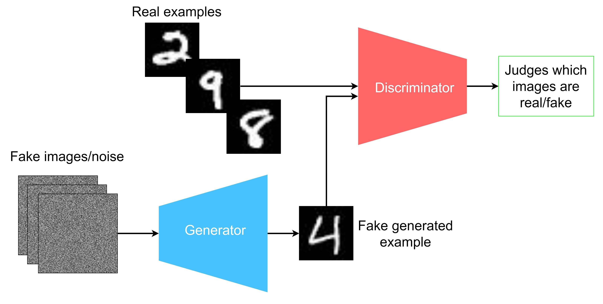

# BiomolGeneration

The generation of biomolecules using Generative Adversarial Networks (GANs) and diffusion models is an advanced technique in computational biology and chemistry. These methods aim to create new biomolecules, such as proteins, small molecules, or drug candidates, that exhibit desired properties or functions. Let’s dive into how GANs and diffusion models are used for this purpose.

### 1. Generative Adversarial Networks (GANs) for Biomolecule Generation

#### What are GANs?
GANs consist of two neural networks: a generator and a discriminator. These networks are trained together in a competitive framework:
- **Generator**: Creates fake data (synthetic biomolecules) from random noise.
- **Discriminator**: Tries to distinguish between real data (existing biomolecules) and the fake data generated by the generator.
- The goal is for the generator to produce data that the discriminator can no longer distinguish from real data, thereby generating realistic synthetic biomolecules.

#### How GANs Are Applied to Biomolecule Generation
- **Molecular Structure Generation**: GANs can be used to generate new molecular structures, such as small organic molecules, peptides, or even protein fragments. The generator learns from a dataset of known molecular structures and creates new candidates.
- **Molecular Optimization**: GANs can also be applied to optimize molecular properties, such as binding affinity, solubility, or stability. The generator creates molecules with improved characteristics based on the feedback received from the discriminator.
- **Conditional GANs (cGANs)**: These GANs incorporate additional information (e.g., desired molecular properties) into the generation process, allowing for more controlled and property-specific molecule generation.

#### Challenges with GANs in Biomolecule Generation
- **Mode Collapse**: The generator might produce only a limited set of similar molecules, lacking diversity.
- **Training Stability**: GANs can be difficult to train, as the balance between the generator and discriminator is crucial.
- **Quality of Generated Molecules**: The generated molecules might not always be chemically valid or biologically relevant.

### 2. Diffusion Models for Biomolecule Generation

#### What Are Diffusion Models?
Diffusion models are a class of generative models that learn to generate data by reversing a diffusion process. They progressively transform random noise into a structured output, such as a molecule, through a series of refinement steps:
- **Forward Process (Diffusion)**: Data is gradually corrupted by adding noise in small steps, leading from a clean molecule representation to random noise.
- **Reverse Process (Denoising)**: A neural network learns to reverse the diffusion process step-by-step, transforming random noise back into a valid molecular structure.

#### How Diffusion Models Are Applied to Biomolecule Generation
- **Molecular Structure Generation**: By learning the reverse diffusion process, these models can generate molecular structures from noise. This approach can produce diverse and high-quality molecular structures.
- **Protein Folding and Structure Prediction**: Diffusion models can be used to predict protein structures by generating 3D atomic coordinates from noise, guided by known protein folding rules or structural constraints.
- **Conditional Generation with Desired Properties**: Like cGANs, diffusion models can incorporate property constraints into the generation process to produce molecules with specific characteristics.

#### Advantages of Diffusion Models in Biomolecule Generation
- **High Diversity**: Diffusion models tend to produce a diverse set of molecules compared to GANs.
- **Stable Training**: These models are generally more stable to train than GANs, as they don’t require a discriminator.
- **High Quality of Generated Structures**: The progressive refinement process of diffusion models can produce very accurate and realistic molecular structures.

### Comparing GANs and Diffusion Models for Biomolecule Generation

| **Aspect**                       | **GANs**                                      | **Diffusion Models**                           |
|----------------------------------|-----------------------------------------------|-----------------------------------------------|
| **Training Stability**           | More difficult; sensitive to balance          | More stable; does not involve adversarial loss|
| **Quality of Generated Molecules** | Can suffer from mode collapse                 | Generally higher quality and diversity        |
| **Control over Generation**      | Achievable with cGANs                         | Naturally integrates conditional information  |
| **Diversity of Outputs**         | May be limited due to mode collapse           | Typically higher diversity                    |

### Applications of Biomolecule Generation by GANs and Diffusion Models
1. **Drug Discovery**: Generating novel drug candidates with improved pharmacological properties.
2. **Protein Design**: Designing synthetic proteins or peptides with specific functions, such as enzymes or therapeutic proteins.
3. **Material Science**: Creating new materials with desired molecular properties for applications in nanotechnology or biotechnology.

### Challenges and Future Directions
- **Chemical Validity**: Ensuring generated molecules are chemically valid and synthesizable.
- **Biological Relevance**: Validating that generated biomolecules exhibit the desired biological activity.
- **Integration with Experimental Data**: Using experimental feedback to refine models and improve the accuracy of generated molecules.

In summary, both GANs and diffusion models are powerful tools for generating new biomolecules, with diffusion models generally providing higher quality and more diverse results. As these techniques evolve, they hold great promise for accelerating the discovery of new drugs and materials.
